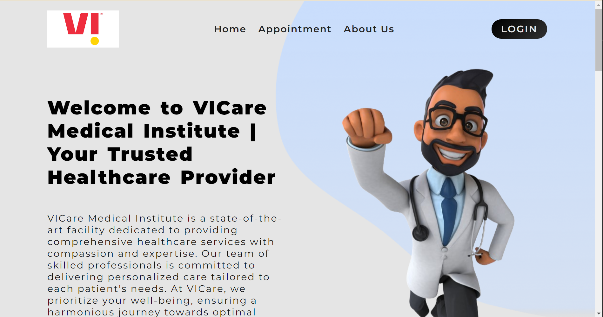

## Hospital Management System
    ⚡ Hospital Management System, I built using MERN Stack.

# Getting Started with Create React App

This project was bootstrapped with [Create React App](https://github.com/facebook/create-react-app).

## Available Scripts

In the project directory, you can run:

### `npm run dev`

Runs the app in the development mode.\
Open [http://localhost:5173](http://localhost:5173) to view it in your browser.

The page will reload when you make changes.\
You may also see any lint errors in the console.

### `npm run build`

Builds the app for production to the `build` folder.\
It correctly bundles React in production mode and optimizes the build for the best performance.

The build is minified and the filenames include the hashes.\
Your app is ready to be deployed!

See the section about [deployment](https://facebook.github.io/create-react-app/docs/deployment) for more information.

##  Youtube
<h4>If you like, do follow me on Youtube</h4>
<a href="https://www.youtube.com/@Code-With-Vishal">Connect with me on  Youtube</a>

##  Instagram
<h4>If you like, do follow me on Instagram</h4>
<a href="https://www.instagram.com/monstrvishal">Connect with me on Instagram</a>

## License

This project is licensed under the MIT License.
